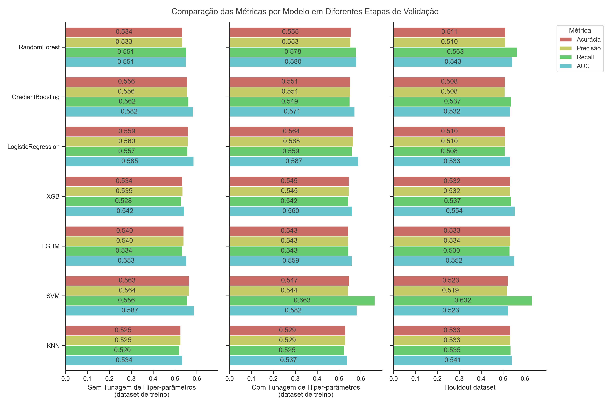
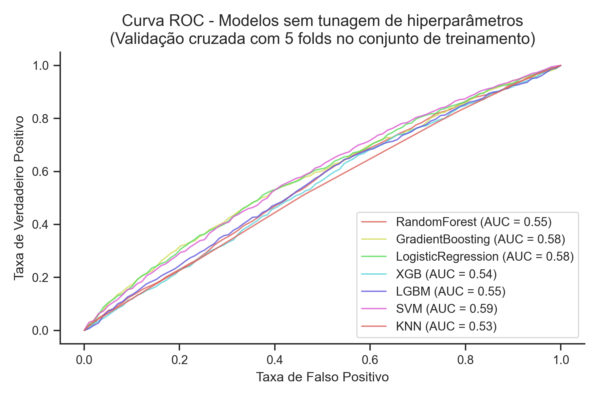
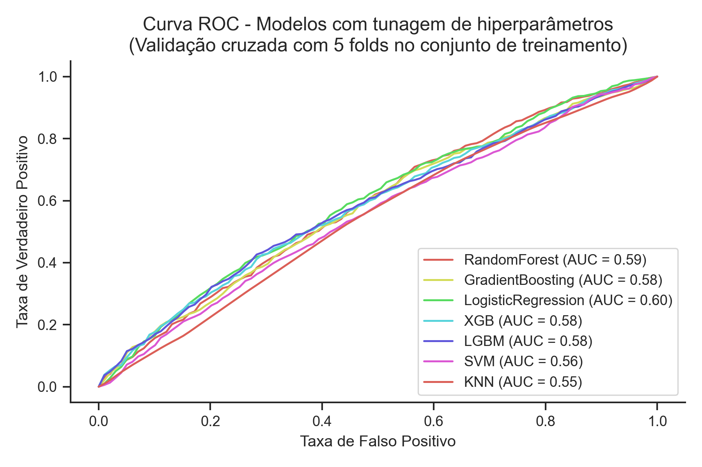
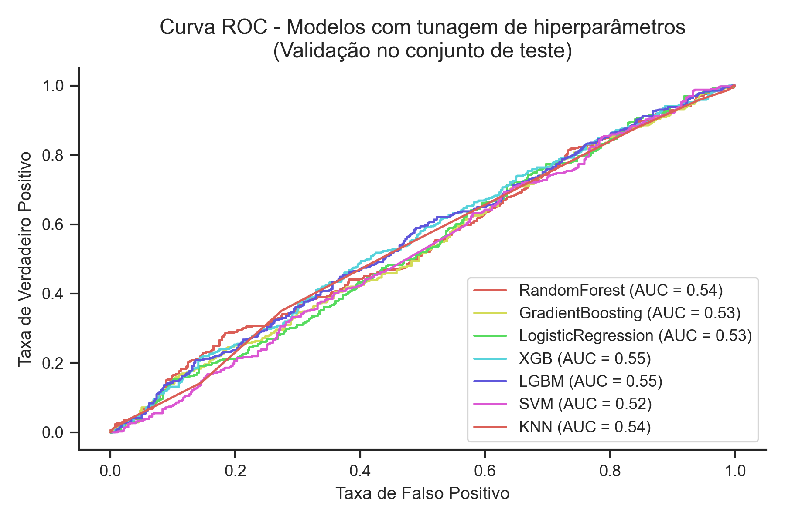

# 0. Pequeno resumo pra refrescar a memória

A ideia do meu trabalho era: trabalhar com uma base dados de internações de pacientes, testar diversos modelos pra prever quais pacientes podem ser reinternados e então estudar quais variáveis estão mais associadas a casos de reinternação utilizando a técnica de XAI do SHAP values.

Esse [artigo aqui](https://github.com/matheusnice/tcc-mba-cd-2023/blob/master/references/Barros2016_Article_ImpactOfLengthOfStayForFirstPs.pdf) de Barros et. al (2016) também trabalha com essa base de dados, mas eles estudam o impacto do tempo de internação na reinternação de pacientes. E lá eles dizem que, não apenas do tempo de internação, mas nenhuma outra variável pareceus ter algum impacto estatisticamente significativo na reinternação.

# 1. Limpeza dos dados

Grande parte do trabalho foi feito aqui, já que os dados são provenientes de anotações manuais, então tive que fazer uma boa limpeza.
Aqui também foi a parte onde eu criei a variável target (reinternação).

Você pode olhar os detalhes no notebook [01-tcc-initial-data-cleaning](https://github.com/matheusnice/tcc-mba-cd-2023/blob/master/notebooks/01-tcc-initial-data-cleaning.ipynb)

# 2. Seleção de modelos
Depois de separar os dados em treinamento e teste, e de fazer um undersampling para balancear a variável target, eu estruturei a parte de seleção dos modelos assim
1. Eu escolhi alguns modelos e um conjunto de hiperparâmetros para cada
2. Treinei os modelos (com os hiperparâmetros padrão) nos dados de treino fazendo validação cruzada com 5 folds. Anotei as métricas acurácia, precisão, recall e AUC.
3. Treinei os modelos (agora utilizando GridSearch pra tunar os hiperparâmetros) nos dados de treino fazendo validação cruzada com 5 folds. Anotei também as métricas de acurácia, precisão, recall e AUC
4. Peguei os melhores modelos que foram selecionados no grid search e validei eles usando o conjunto de teste que eu havia separado lá no começo.

Você pode olhar os detalhes no notebook [02-tcc-model-selection.ipynb](https://github.com/matheusnice/tcc-mba-cd-2023/blob/master/notebooks/02-tcc-model-selection.ipynb)

# 3. Resultados

Os resultados (em todas as etapas de validação acima) não foram lá muito bons. O melhor modelo no conjunto de teste foi o LightGBM com uma acurácia de 0.533 e AUC de 0.552. Abaixo segue um gráfico com todas as métricas de todos os modelos em todas etapadas de validação

Também plotei as curvas ROC para cada etapa de validação

Você pode olhar os detalhes no notebook [03-tcc-evaluation.ipynb](https://github.com/matheusnice/tcc-mba-cd-2023/blob/master/notebooks/03-tcc-evaluation.ipynb)

# 4. Análise de feature importance usando SHAP

Mesmo os modelos não tendo tão bons resultados, eu fiz a análise de quais variáveis tem mais importância no output do melhor modelo que tivemos (no caso, o LightGBM).
Acho que ainda assim dá pra fazer uma análise interessante dessas variáveis, tipo

- Pessoas solteiras estão mais propensas a casos de reinternação
- O tempo de internação em horas parece ser inversamente proporcional ao impacto que essa variável tem em aumentar a probabilidade de reinternação (quem fica menos horas internados tem mais chance de se reinternar)
- Pessoas mais jovens tbm parecem ser mais propensar a reinternação
- O mês e dia da semana de internação tbm apareceram como importantes (eu usei transformações trigonométricas pra capturar o padrão cíclico dessas datas, por isso tem um "_sin" ou "_cos" nessas variáveis)

